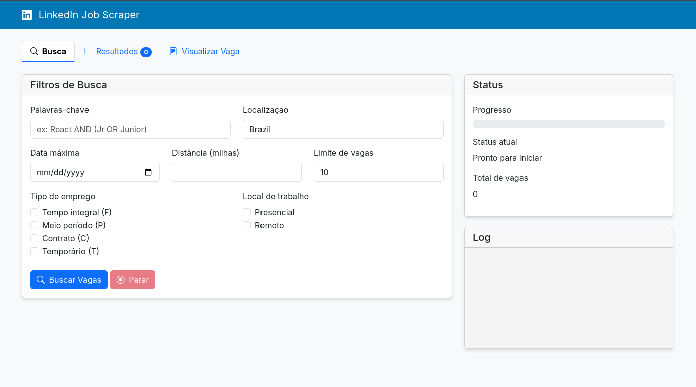

# LinkedIn Job Scraper with Python || 2.0
.
A simple scraper to search for jobs on LinkedIn based on keywords, job type, location, and maximum date. Supports advanced searches with boolean logic (AND/OR) and detailed filters.

## 🚀 Features

- 🔍 **Advanced Search**: Use boolean operators (AND/OR) for keyword combinations
- 🗂️ **Job Filters**: Filter by job type (full-time, part-time, contract, etc.)
- 📍 **Location Filter**: Select between in-person, remote, or hybrid
- 📅 **Date Filter**: Filter jobs by time range (last 24h, 7 days, 30 days)
- 🎯 **Simple Search**: Allows simple searches by keywords

## 🛠️ Technologies

- Python
- Requests
- Flask

## 📦 Installation

1. Clone the repository:
`git@github.com:realmcastro/ScrapingLinkedinFlask.git | cd ScrapingLinkedinFlask`

2. Install the dependencies:
`pip install -r requirements.txt`

3. Run the scraper:
`python app.py`

## 🔧 Usage

### Simple Search

To perform a simple search for a keyword like "react":
just submit the keyword as an argument!

### Advanced Search (AND/OR)

To perform a combined search with boolean operators:
python app.py "react AND junior"
python app.py "react OR angular"
python app.py "react OR angular AND junior"

### Filter by Maximum Date

To search for jobs up to a specific date:
python app.py "react" --max-date "2023-10-01"

### Filter by Job Type and Location

To filter jobs by type and location:
python app.py "react" --job-type F --place 2

### What are `--job-type` and `--place` for?

- **--job-type**: Filters the job type. Possible values:
  - F → Full-time
  - CP → Part-time
  - CC → Contract
  - T → Temporary
  - CV → Volunteer

- **--place**: Filters the job location. Possible values:
  - 1 → In-person
  - 2 → Remote
  - 3 → Hybrid

## 📁 Project Structure

linkedin-job-scraper/

├── scraper.py        # Main file that runs the scraper
├── App.py        # Main file that runs the scraper
├── requirements.txt  # Project dependencies

└── README.md         # Project documentation

## ⚠️ Important Notes

- **Limitations**: LinkedIn may block access to the scraper after multiple requests in a short period of time.
- **Compatibility**: This project has been tested on Python 3.x.

## 📝 License

This project is under the MIT license. See the [LICENSE](LICENSE) file for more details.

Preview:
